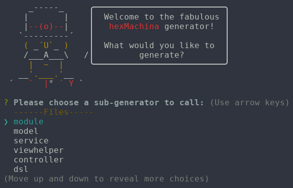

# generator-hex
> Project generator for hexMachina framework

## Installation

First, install [Yeoman](http://yeoman.io) and generator-hex using [npm](https://www.npmjs.com/)
(we assume you have pre-installed [node.js](https://nodejs.org/)).

```bash
npm install -g yo
npm install -g https://github.com/DoclerLabs/generator-hex.git
```

## Usage

To get started,
open up the command line / terminal and call the hexMachina generator like this:

```bash
yo hex
```
Yeoman will greet you and ask what you want to generate:


Just choose the generator you want and answer yeoman's questions.

You can also run a sub-generator directly like this:
```bash
yo hex:module
```
There are the following two different kinds of generators for hexMachina:

###Project generator
The project generator gets you started by generating the basic project:


It can create some source files and either FlashDevelop project files or hxml files.

###File generators
All the other generators are file generators.
They are designed to be used on an existing project.

You should not run them from your project folder,
but from your source folder or from a subfolder if your source folder instead.
See the example below for more info.

###Example
####Generating the project
So to start a project, create a new folder first:
```bash
mkdir example
cd example
```
Then you just run the project generator:
```bash
yo hex:project
```
After that your folder structure should look similar to this one
(depending on which target and project type you chose):
```
.
├── bin
│   └── index.html
├── src
│   └── com
│       └── test
│           └── application
│               ├── configuration
│               │   ├── context.xml
│               │   ├── ModuleConfiguration.xml
│               │   ├── ServiceConfiguration.xml
│               │   └── ViewConfiguration.xml
│               └── Main.hx
└── yeoman_test.hxproj
```

####Generating a file
Now you want to add some files to this. Let's say you want to create a new module.
You also want this module to be in the `com.test.application` package.
To put it there, change into the package directory and run the generator:
```bash
cd src/com/test/application
yo hex:module
```
The first thing it will ask you is the package you are in. In this case you should enter:
```
com.test.application
```
You could also pass it as a command line option when running the generator, like this:
```bash
yo hex:module --currentPackage=com.test.application
```
The next thing you should enter is a list of modules you want to create.
For example:
```
Test,stub.Example
```
After that, you will be asked some questions about the individual modules.
For now, just answer no every time.

The generator should create four new files within your package directory:
```
.
├── stub
│   ├── ExampleModule.hx
│   └── IExampleModule.hx
└── test
    ├── ITestModule.hx
    └── TestModule.hx
```
